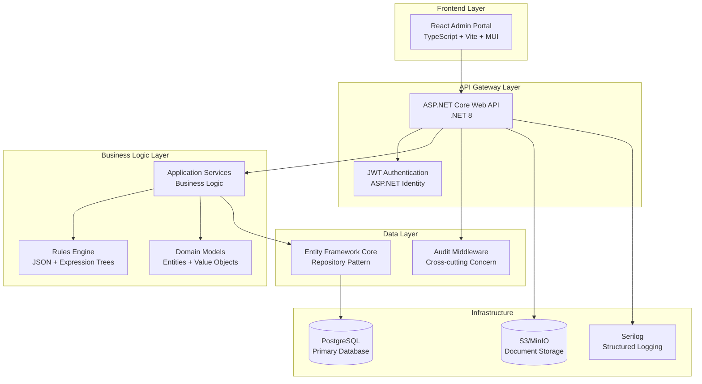
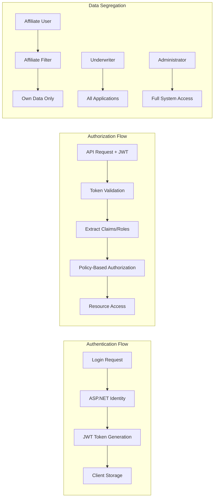
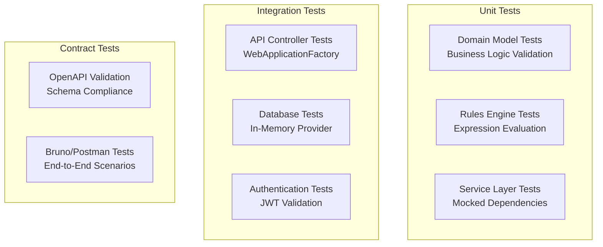
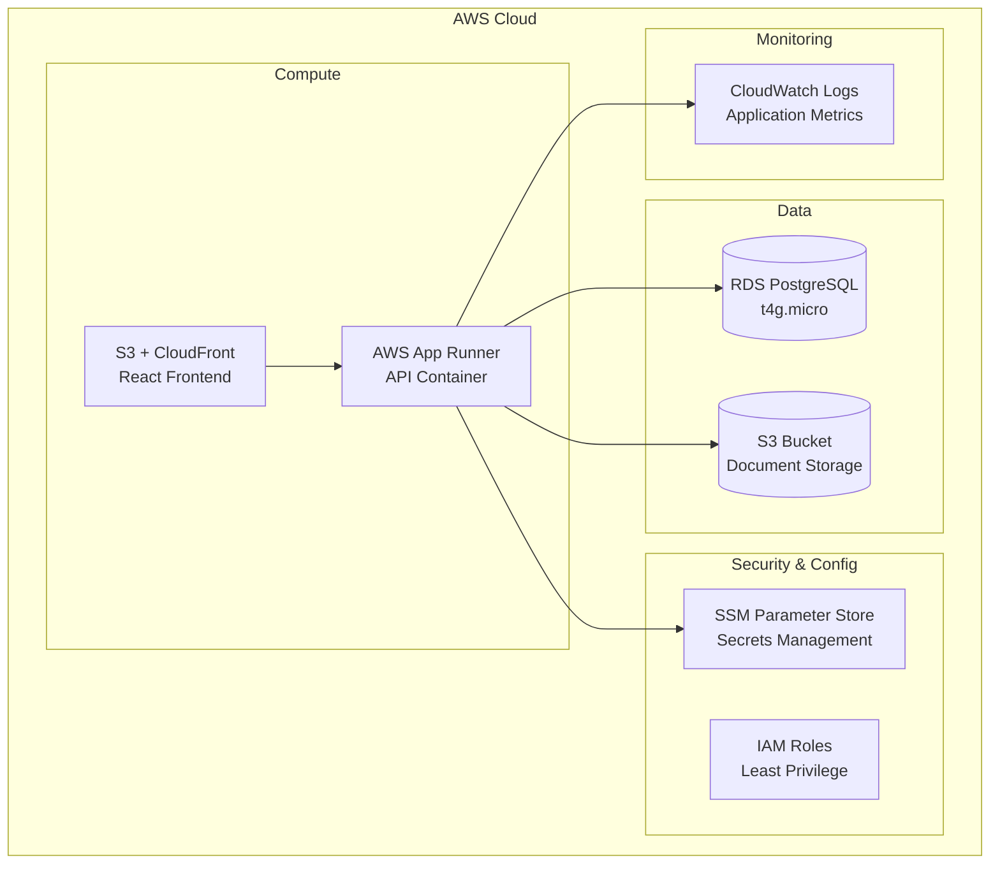

# SmartUnderwrite MVP - Design Document

## Overview

SmartUnderwrite is designed as a cloud-native, microservice-oriented application built on .NET 8 with a React frontend. The architecture emphasizes separation of concerns, testability, and scalability while maintaining simplicity for MVP requirements. The system follows Domain-Driven Design principles with clear boundaries between business logic, data access, and presentation layers.

## Architecture

### High-Level Architecture



### Security Architecture



## Components and Interfaces

### Core Domain Models

**Entities:**

- `Affiliate`: Represents partner organizations submitting applications
- `User`: System users with roles (Admin, Underwriter, Affiliate)
- `Applicant`: Loan applicant personal information
- `LoanApplication`: Core business entity representing loan requests
- `Document`: File attachments linked to applications
- `Decision`: Evaluation results from rules engine or manual review
- `Rule`: Configurable business rules for automated evaluation
- `AuditLog`: Immutable audit trail for compliance

**Value Objects:**

- `Address`: Structured address information
- `DecisionOutcome`: Enumeration (Approve, Reject, ManualReview)
- `ApplicationStatus`: Workflow states (Submitted, Evaluated, etc.)
- `RuleDefinition`: JSON-based rule configuration

### Service Layer Architecture

```csharp
// Application Services Interface Pattern
public interface IApplicationService
{
    Task<LoanApplicationDto> CreateApplicationAsync(CreateApplicationRequest request, int affiliateId);
    Task<LoanApplicationDto> GetApplicationAsync(int id, ClaimsPrincipal user);
    Task<PagedResult<LoanApplicationDto>> GetApplicationsAsync(ApplicationFilter filter, ClaimsPrincipal user);
    Task<DecisionDto> EvaluateApplicationAsync(int applicationId);
    Task<DecisionDto> MakeManualDecisionAsync(int applicationId, ManualDecisionRequest request, int userId);
}

public interface IRulesEngine
{
    Task<EvaluationResult> EvaluateAsync(LoanApplication application, Applicant applicant);
    Task<bool> ValidateRuleDefinitionAsync(string ruleJson);
}

public interface IDocumentService
{
    Task<string> UploadDocumentAsync(int applicationId, IFormFile file);
    Task<DocumentDto> GetDocumentAsync(int documentId, ClaimsPrincipal user);
}
```

### Rules Engine Design

The rules engine uses a hybrid approach combining JSON configuration with compiled expression trees for performance:

```json
{
  "name": "Basic Credit & DTI",
  "priority": 10,
  "clauses": [
    {
      "if": "CreditScore < 550",
      "then": "REJECT",
      "reason": "Low credit score"
    },
    {
      "if": "IncomeMonthly <= 0",
      "then": "MANUAL",
      "reason": "No income provided"
    },
    {
      "if": "Amount > 50000 && CreditScore < 680",
      "then": "MANUAL",
      "reason": "High amount risk"
    }
  ],
  "score": {
    "base": 600,
    "add": [
      {
        "when": "CreditScore >= 720",
        "points": 50
      }
    ]
  }
}
```

**Rules Engine Components:**

- `RuleParser`: Converts JSON to expression trees
- `RuleEvaluator`: Executes compiled expressions against application data
- `ScoreCalculator`: Computes risk scores based on rule outcomes
- `IRuleHandler`: Extension point for custom rule logic

## Data Models

### Entity Framework Core Schema

```csharp
// Core Entities with EF Configuration
public class LoanApplication
{
    public int Id { get; set; }
    public int AffiliateId { get; set; }
    public int ApplicantId { get; set; }
    public string ProductType { get; set; }
    public decimal Amount { get; set; }
    public decimal IncomeMonthly { get; set; }
    public string EmploymentType { get; set; }
    public int? CreditScore { get; set; }
    public ApplicationStatus Status { get; set; }
    public DateTime CreatedAt { get; set; }

    // Navigation Properties
    public Affiliate Affiliate { get; set; }
    public Applicant Applicant { get; set; }
    public ICollection<Document> Documents { get; set; }
    public ICollection<Decision> Decisions { get; set; }
}

public class Decision
{
    public int Id { get; set; }
    public int LoanApplicationId { get; set; }
    public DecisionOutcome Outcome { get; set; }
    public int Score { get; set; }
    public string[] Reasons { get; set; } // JSON array
    public int? DecidedByUserId { get; set; }
    public DateTime DecidedAt { get; set; }

    // Navigation Properties
    public LoanApplication LoanApplication { get; set; }
    public User DecidedByUser { get; set; }
}
```

### Database Indexes Strategy

```sql
-- Performance-critical indexes
CREATE INDEX IX_LoanApplication_AffiliateId_Status ON LoanApplications(AffiliateId, Status);
CREATE INDEX IX_LoanApplication_Status_CreatedAt ON LoanApplications(Status, CreatedAt);
CREATE INDEX IX_AuditLog_EntityType_EntityId ON AuditLogs(EntityType, EntityId);
CREATE INDEX IX_AuditLog_CreatedAt ON AuditLogs(CreatedAt);
CREATE INDEX IX_Rule_IsActive_Priority ON Rules(IsActive, Priority);
```

## Error Handling

### Exception Hierarchy

```csharp
public abstract class SmartUnderwriteException : Exception
{
    public string ErrorCode { get; }
    protected SmartUnderwriteException(string errorCode, string message) : base(message)
    {
        ErrorCode = errorCode;
    }
}

public class BusinessRuleException : SmartUnderwriteException
{
    public BusinessRuleException(string message) : base("BUSINESS_RULE_VIOLATION", message) { }
}

public class UnauthorizedAccessException : SmartUnderwriteException
{
    public UnauthorizedAccessException(string message) : base("UNAUTHORIZED_ACCESS", message) { }
}

public class ValidationException : SmartUnderwriteException
{
    public Dictionary<string, string[]> Errors { get; }
    public ValidationException(Dictionary<string, string[]> errors)
        : base("VALIDATION_ERROR", "One or more validation errors occurred")
    {
        Errors = errors;
    }
}
```

### Global Exception Handling

```csharp
public class GlobalExceptionMiddleware
{
    public async Task InvokeAsync(HttpContext context, RequestDelegate next)
    {
        try
        {
            await next(context);
        }
        catch (SmartUnderwriteException ex)
        {
            await HandleSmartUnderwriteExceptionAsync(context, ex);
        }
        catch (Exception ex)
        {
            await HandleGenericExceptionAsync(context, ex);
        }
    }
}
```

## Testing Strategy

### Test Architecture



### Test Data Strategy

**Seeded Test Data:**

- 3 Affiliates with different configurations
- 30 Loan Applications with varied risk profiles
- 5 Business Rules covering common scenarios
- Test users for each role (Admin, Underwriter, Affiliate)

**Test Scenarios:**

- Happy path: Application submission → Evaluation → Approval
- Edge cases: Missing data, boundary conditions, rule conflicts
- Security: Cross-affiliate access attempts, role violations
- Performance: Bulk rule evaluation, concurrent access

### Testing Tools and Frameworks

- **xUnit**: Primary testing framework
- **FluentAssertions**: Readable test assertions
- **Moq**: Mocking framework for dependencies
- **WebApplicationFactory**: Integration testing
- **Testcontainers**: Database integration tests
- **Bruno/Postman**: API contract testing

## Deployment Architecture

### AWS Infrastructure



### CI/CD Pipeline

```yaml
# GitHub Actions Workflow
name: Deploy SmartUnderwrite
on:
  push:
    branches: [main]

jobs:
  test:
    runs-on: ubuntu-latest
    steps:
      - name: Run Unit Tests
        run: dotnet test --collect:"XPlat Code Coverage"
      - name: Run Integration Tests
        run: dotnet test --filter Category=Integration

  build:
    needs: test
    runs-on: ubuntu-latest
    steps:
      - name: Build API Container
        run: docker build -t smartunderwrite-api .
      - name: Build React Frontend
        run: npm run build

  deploy:
    needs: build
    runs-on: ubuntu-latest
    environment: production
    steps:
      - name: Terraform Plan
        run: terraform plan
      - name: Manual Approval Required
        uses: trstringer/manual-approval@v1
      - name: Terraform Apply
        run: terraform apply -auto-approve
```

### Environment Configuration

**Development:**

- Docker Compose with PostgreSQL and MinIO
- Hot reload for API and frontend
- Seeded test data
- Console logging

**Production:**

- AWS managed services (RDS, S3, App Runner)
- CloudWatch logging with structured logs
- SSM Parameter Store for secrets
- Health checks and monitoring

## Security Considerations

### Data Protection

- **PII Handling**: SSN stored as salted hash, never logged in plain text
- **Encryption**: TLS 1.3 for data in transit, AES-256 for data at rest
- **Access Control**: Role-based authorization with affiliate data segregation
- **Audit Trail**: Immutable logs for all data access and modifications

### Authentication & Authorization

- **JWT Tokens**: Short-lived (15 minutes) with refresh token rotation
- **Role Hierarchy**: Admin > Underwriter > Affiliate with clear permissions
- **API Security**: Rate limiting, CORS configuration, input validation
- **Infrastructure**: IAM roles with least privilege principle

### Compliance Features

- **Audit Logging**: Complete trail of all system actions
- **Data Retention**: Configurable retention policies for different data types
- **Access Monitoring**: Failed login attempts and suspicious activity detection
- **Regulatory Reporting**: Structured data export capabilities

This design provides a solid foundation for the SmartUnderwrite MVP while maintaining flexibility for future enhancements and scalability requirements.
